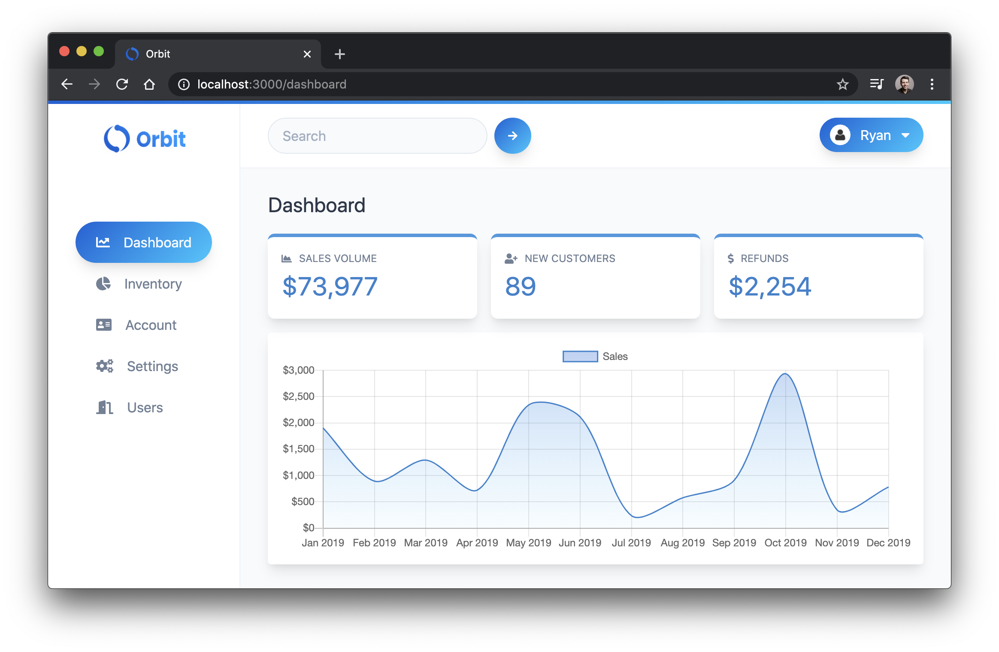
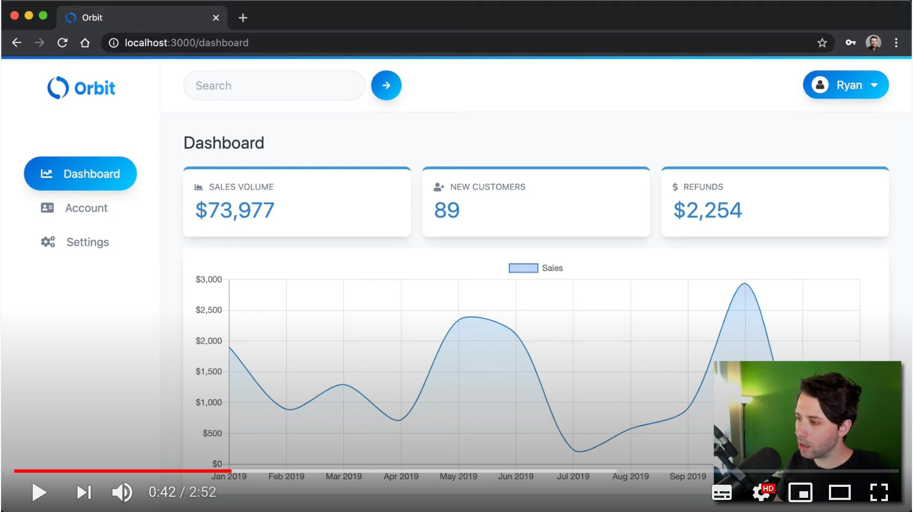

# ReactSecurity - Orbit

<p>
  <a href="https://twitter.com/ryanchenkie" target="_blank">
    
  </a>
</p>

👋 Welcome to Orbit! This is a demo app for learning security for React applications. You can find out more at [ReactSecurity.io](https://reactsecurity.io).

## A Look at the App

Here's the dashboard for the app


For a more in-depth tour, check out this video:

[](https://www.youtube.com/watch?v=cTAizIOENZw)

There are two parts to the app in this project: **orbit-app** and **orbit-api**. These are the front end React application and the backend Node API respectively.

## Install the Dependencies

We need to install dependencies for both **orbit-app** and **orbit-api**. Change directories into each and install with **npm** or **yarn**.

With **npm**:

```bash
cd orbit-app
npm install
cd ../orbit-api
npm install
```

With **yarn**:

```bash
cd orbit-app
yarn
cd ../orbit-api
yarn
```

## Set Up the Environment Files

The React app contains a file called `.env.local`. This file has a single variable called `REACT_APP_API_URL` which is used to connect to the backend. You can leave this as is.

The backend contains a file called `.env.example`. This file needs to be renamed to `.env` and provided with values.

For `ATLAS_URL`, provide the connection string to your MongoDB Atlas cluster. You can use other MongoDB providers, or even use a local MongoDB connection. Learn how to create a MongoDB instance with Atlas [here](https://www.mongodb.com/download-center).

For `JWT_SECRET`, provide a long, strong, unguessable secret, much like you would in production.

## Run the Applications

The React app is built with **create-react-app**. Run it with the script provided in its **package.json** file.

```bash
cd orbit-app
npm start
```

The Node API comes with a script in its `package.json` which allows you to run it in development mode with **nodemon**.

Open a new terminal window, change directories into the API, and start it up.

```bash
cd orbit-api
npm run dev
```

The Node API will be running at `http://localhost:3001`.

Navigate to `http://localhost:3000` to see the app running!

## License

MIT
